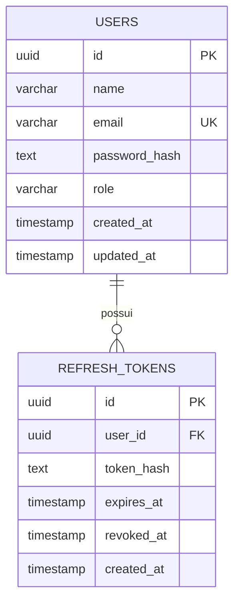

# Auth Service — Design

## 1. Visão Geral

O **Auth Service** é um microserviço responsável pela autenticação, identidade e gerenciamento de sessões dos usuários.

O serviço será desenvolvido em **Go** e funcionará de maneira independente dos demais serviços da aplicação. Sua principal responsabilidade será validar credenciais, emitir tokens de acesso e permitir que outros serviços verifiquem a identidade e as permissões do usuário.

A primeira versão terá escopo reduzido, priorizando simplicidade, segurança e facilidade de integração com outros backends.

---

## 2. Objetivos

O Auth Service deverá fornecer:

* cadastro de usuários;
* autenticação utilizando e-mail e senha;
* armazenamento seguro de senhas;
* emissão de access tokens;
* emissão e renovação de refresh tokens;
* rotação de refresh tokens;
* revogação de sessões;
* identificação do usuário autenticado;
* suporte básico a papéis de usuário;
* disponibilização da chave pública utilizada na validação dos tokens.

---

## 3. Fora do Escopo Inicial

Os seguintes recursos não fazem parte da primeira versão:

* autenticação com Google;
* autenticação com Microsoft;
* autenticação com GitHub;
* autenticação multifator (MFA);
* login por código enviado por e-mail;
* recuperação de senha;
* confirmação de e-mail;
* Single Sign-On (SSO);
* integração com LDAP;
* implementação completa de um servidor OAuth2/OpenID Connect.

Esses recursos poderão ser adicionados futuramente caso exista necessidade.

---

## 4. Arquitetura

A arquitetura será baseada em um serviço independente de autenticação.

```text
                     ┌──────────────────┐
                     │     Frontend     │
                     └────────┬─────────┘
                              │
                              │ Login / Register
                              ▼
                     ┌──────────────────┐
                     │   Auth Service   │
                     │       Go         │
                     └────────┬─────────┘
                              │
                              ▼
                     ┌──────────────────┐
                     │    PostgreSQL    │
                     └──────────────────┘


Após autenticação:

Frontend
    │
    │ Authorization: Bearer <JWT>
    ▼
┌─────────────────────┐
│ Outros Backends     │
│ Spring Boot / Go    │
└──────────┬──────────┘
           │
           │ valida assinatura
           ▼
       Chave pública
```

O Auth Service será responsável por **assinar os JWTs utilizando uma chave privada**.

Os demais serviços utilizarão apenas a chave pública para verificar a autenticidade desses tokens.

Dessa forma, outros serviços poderão validar tokens sem precisar realizar uma requisição ao Auth Service para cada chamada.

---

## 5. Responsabilidades

### Auth Service

O Auth Service será responsável por:

* receber credenciais;
* validar credenciais;
* gerar hash de senhas;
* verificar hashes de senhas;
* emitir access tokens;
* emitir refresh tokens;
* realizar rotação de refresh tokens;
* revogar sessões;
* armazenar informações de usuários;
* armazenar sessões e refresh tokens;
* fornecer informações básicas do usuário autenticado;
* disponibilizar as chaves públicas utilizadas na assinatura dos JWTs.

### Outros serviços

Os demais serviços serão responsáveis por:

* receber o JWT enviado pelo cliente;
* verificar sua assinatura;
* verificar sua validade;
* verificar issuer e demais claims necessárias;
* extrair o identificador do usuário;
* aplicar regras de autorização específicas do domínio.

---

## 6. Stack Inicial

A primeira versão utilizará:

| Tecnologia | Uso                        |
| ---------- | -------------------------- |
| Go         | Linguagem principal        |
| Chi        | Roteamento HTTP            |
| PostgreSQL | Banco de dados             |
| pgx        | Comunicação com PostgreSQL |
| JWT        | Access tokens              |
| Argon2id   | Hash de senhas             |
| Docker     | Containerização            |

Dependências adicionais deverão ser adicionadas apenas quando houver necessidade clara.

---

## 7. Estrutura Inicial do Projeto

```text
auth-service/
├── cmd/
│   └── api/
│       └── main.go
│
├── internal/
│   ├── auth/
│   │   ├── handler.go
│   │   ├── service.go
│   │   └── repository.go
│   │
│   ├── user/
│   │   ├── model.go
│   │   ├── service.go
│   │   └── repository.go
│   │
│   ├── token/
│   │   ├── jwt.go
│   │   └── refresh.go
│   │
│   ├── database/
│   │   └── postgres.go
│   │
│   └── config/
│       └── config.go
│
├── migrations/
│
├── docs/
│   └── design.md
│
├── Dockerfile
├── compose.yaml
├── go.mod
├── go.sum
└── README.md
```

Essa estrutura poderá evoluir conforme o serviço crescer.

---

## 8. API

A API seguirá inicialmente o prefixo:

```text
/api/v1
```

### 8.1 Cadastro

```http
POST /api/v1/auth/register
```

Cria um novo usuário.

#### Request

```json
{
  "name": "João",
  "email": "joao@example.com",
  "password": "senha-segura"
}
```

#### Response

```http
201 Created
```

Exemplo:

```json
{
  "id": "550e8400-e29b-41d4-a716-446655440000",
  "name": "João",
  "email": "joao@example.com"
}
```

A senha nunca deverá ser retornada pela API.

---

### 8.2 Login

```http
POST /api/v1/auth/login
```

Autentica um usuário utilizando e-mail e senha.

#### Request

```json
{
  "email": "joao@example.com",
  "password": "senha-segura"
}
```

#### Response

```http
200 OK
```

Exemplo:

```json
{
  "accessToken": "<jwt>",
  "refreshToken": "<refresh-token>",
  "tokenType": "Bearer",
  "expiresIn": 900
}
```

---

### 8.3 Renovação de Token

```http
POST /api/v1/auth/refresh
```

Utiliza um refresh token válido para obter um novo access token.

A operação deverá realizar **rotação do refresh token**.

Isso significa que, após utilizar um refresh token com sucesso:

1. o token anterior será invalidado;
2. um novo access token será emitido;
3. um novo refresh token será emitido.

---

### 8.4 Logout

```http
POST /api/v1/auth/logout
```

Revoga a sessão associada ao refresh token informado.

Após a revogação, o refresh token não poderá ser utilizado novamente.

---

### 8.5 Usuário Atual

```http
GET /api/v1/users/me
```

Retorna informações sobre o usuário autenticado.

#### Header

```http
Authorization: Bearer <access_token>
```

#### Response

```json
{
  "id": "550e8400-e29b-41d4-a716-446655440000",
  "name": "João",
  "email": "joao@example.com",
  "roles": [
    "USER"
  ]
}
```

---

### 8.6 Chaves Públicas

```http
GET /.well-known/jwks.json
```

Disponibiliza as chaves públicas necessárias para validação dos tokens emitidos pelo Auth Service.

Esse endpoint permitirá que outros serviços validem JWTs sem possuir acesso à chave privada.

---

## 9. Autenticação

O fluxo básico será:

```text
Usuário
   │
   │ email + senha
   ▼
Frontend
   │
   │ POST /auth/login
   ▼
Auth Service
   │
   ├── busca usuário
   ├── verifica senha
   ├── cria sessão
   ├── gera access token
   └── gera refresh token
   │
   ▼
Frontend
```

Após o login, o cliente utilizará:

```http
Authorization: Bearer <access_token>
```

nas chamadas aos serviços protegidos.

---

## 10. Access Token

O access token será um **JWT de curta duração**.

Duração inicial sugerida:

```text
15 minutos
```

O JWT deverá conter somente informações necessárias para autenticação e autorização.

Exemplo de payload:

```json
{
  "sub": "550e8400-e29b-41d4-a716-446655440000",
  "email": "joao@example.com",
  "roles": [
    "USER"
  ],
  "iss": "auth-service",
  "iat": 1787330000,
  "exp": 1787330900
}
```

### Claims

#### `sub`

Identificador único do usuário.

#### `iss`

Identifica o serviço responsável pela emissão do token.

#### `iat`

Momento em que o token foi emitido.

#### `exp`

Momento em que o token expira.

#### `roles`

Papéis associados ao usuário.

---

## 11. Assinatura dos JWTs

Será utilizada criptografia assimétrica.

```text
                 Auth Service

                  Private Key
                       │
                       │ assina
                       ▼
                      JWT
                       │
        ┌──────────────┴─────────────┐
        ▼                            ▼
   Service A                    Service B
        │                            │
        └────── Public Key ──────────┘
```

A chave privada permanecerá somente no Auth Service.

Os demais serviços receberão apenas a chave pública.

Uma opção inicial é utilizar:

```text
RSA + SHA-256
```

com tokens `RS256`.

---

## 12. Refresh Tokens

Refresh tokens serão utilizados para criar novos access tokens sem exigir novamente a senha do usuário.

Duração inicial sugerida:

```text
7 dias
```

Esse valor deverá ser configurável.

Refresh tokens:

* não serão JWTs;
* serão valores aleatórios criptograficamente seguros;
* possuirão alta entropia;
* não serão armazenados em texto puro no banco;
* poderão ser revogados;
* possuirão prazo de validade;
* serão rotacionados após utilização.

---

## 13. Rotação de Refresh Token

Fluxo:

```text
Refresh Token A
       │
       │ POST /auth/refresh
       ▼
Auth Service
       │
       ├── verifica token
       ├── invalida Token A
       ├── gera novo Access Token
       └── gera Refresh Token B
                    │
                    ▼
              Cliente recebe B
```

O Refresh Token A não poderá ser reutilizado após a rotação.

---

## 14. Armazenamento de Senhas

Senhas nunca deverão ser armazenadas diretamente.

Será utilizado:

```text
Argon2id
```

O fluxo será:

```text
senha
  │
  ▼
Argon2id
  │
  ▼
hash
  │
  ▼
PostgreSQL
```

Somente o hash será persistido.

Os parâmetros do Argon2id deverão ser configurados considerando segurança e custo computacional adequado ao ambiente de execução.

---

## 15. Banco de Dados

Inicialmente serão necessárias duas entidades principais:

```text
users
refresh_tokens
```

### Users

```text
users
├── id
├── name
├── email
├── password_hash
├── role
├── created_at
└── updated_at
```

### Refresh Tokens

```text
refresh_tokens
├── id
├── user_id
├── token_hash
├── expires_at
├── revoked_at
└── created_at
```

---

## 16. Modelo Inicial do Banco



---

## 17. Regras de Usuário

### E-mail

O e-mail:

* será obrigatório;
* deverá possuir formato válido;
* deverá ser único;
* deverá ser normalizado antes de ser persistido.

Exemplo:

```text
Joao@Example.com
```

deverá ser tratado como:

```text
joao@example.com
```

---

## 18. Papéis de Usuário

Inicialmente será utilizado um sistema simples de roles.

Exemplo:

```text
USER
ADMIN
```

Um usuário comum receberá:

```text
USER
```

por padrão.

A criação ou concessão da role:

```text
ADMIN
```

não deverá ser permitida diretamente pelo endpoint público de cadastro.

---

## 19. Autorização

O Auth Service será responsável por fornecer informações de identidade e papéis.

Entretanto, cada serviço continuará responsável pelas regras específicas do próprio domínio.

Exemplo:

```text
JWT

roles = ["ADMIN"]
       │
       ▼
Internship Service
       │
       ▼
Pode excluir estágio?
```

A decisão final deverá ser realizada pelo serviço responsável pelo recurso.

---

## 20. Respostas de Erro

A API deverá utilizar uma estrutura consistente de erros.

Exemplo:

```json
{
  "error": "invalid_credentials",
  "message": "E-mail ou senha inválidos."
}
```

Exemplos de possíveis códigos:

```text
invalid_credentials
invalid_token
expired_token
user_not_found
email_already_exists
validation_error
unauthorized
forbidden
internal_error
```

---

## 21. Códigos HTTP

Inicialmente deverão ser utilizados:

| Código | Uso                                              |
| ------ | ------------------------------------------------ |
| 200    | Operação realizada com sucesso                   |
| 201    | Recurso criado                                   |
| 400    | Requisição inválida                              |
| 401    | Usuário não autenticado ou credenciais inválidas |
| 403    | Usuário autenticado sem permissão                |
| 404    | Recurso não encontrado                           |
| 409    | Conflito, como e-mail duplicado                  |
| 422    | Dados semanticamente inválidos, caso adotado     |
| 500    | Erro interno                                     |

---

## 22. Configuração

Configurações sensíveis não deverão ser incluídas diretamente no código-fonte.

Exemplos:

```text
DATABASE_URL
JWT_PRIVATE_KEY
JWT_PUBLIC_KEY
ACCESS_TOKEN_TTL
REFRESH_TOKEN_TTL
HTTP_PORT
```

Segredos utilizados em produção não deverão ser versionados no Git.

---

## 23. Observabilidade

A primeira versão deverá possuir pelo menos logging estruturado.

Os logs poderão incluir:

```text
timestamp
level
request_id
method
path
status
duration
```

Dados sensíveis nunca deverão aparecer nos logs.

Exemplos que não devem ser registrados:

* senha;
* access token completo;
* refresh token;
* hash de senha.

---

## 24. Segurança

A implementação deverá considerar inicialmente:

* hash seguro de senhas com Argon2id;
* JWTs de curta duração;
* assinatura assimétrica dos JWTs;
* refresh tokens aleatórios;
* hash dos refresh tokens persistidos;
* rotação de refresh tokens;
* possibilidade de revogação;
* validação rigorosa de entrada;
* proteção contra enumeração desnecessária de usuários;
* ausência de informações sensíveis nos logs;
* secrets fora do repositório;
* HTTPS em ambientes públicos.

---

## 25. Testes

Os principais fluxos deverão possuir testes.

### Cadastro

Testar:

* criação válida;
* e-mail inválido;
* e-mail duplicado;
* senha inválida;
* campos obrigatórios.

### Login

Testar:

* credenciais válidas;
* senha incorreta;
* usuário inexistente.

### JWT

Testar:

* token válido;
* token expirado;
* assinatura inválida;
* issuer incorreto.

### Refresh Token

Testar:

* refresh válido;
* refresh expirado;
* refresh revogado;
* tentativa de reutilização;
* rotação correta.

---

## 26. Fluxo Completo

```text
┌──────────┐
│ Usuário  │
└────┬─────┘
     │
     │ email + senha
     ▼
┌──────────┐
│ Frontend │
└────┬─────┘
     │
     │ POST /auth/login
     ▼
┌─────────────────┐
│  Auth Service   │
│       Go        │
└───────┬─────────┘
        │
        ├── consulta PostgreSQL
        ├── verifica Argon2id
        ├── cria sessão
        ├── assina JWT
        └── gera refresh token
        │
        ▼
┌──────────┐
│ Frontend │
└────┬─────┘
     │
     │ Bearer JWT
     ▼
┌─────────────────┐
│ Business Service│
│   Spring Boot   │
└───────┬─────────┘
        │
        │ verifica chave pública
        ▼
     autorizado
```

---

## 27. Princípios do Projeto

A implementação deverá seguir alguns princípios:

### Simplicidade

Evitar infraestrutura ou abstrações que não sejam necessárias na primeira versão.

### Responsabilidade única

O Auth Service deverá permanecer focado em identidade, autenticação e sessões.

Regras de negócio específicas de outros domínios não deverão ser implementadas nele.

### Segurança por padrão

Recursos relacionados à autenticação deverão utilizar práticas seguras desde a primeira implementação.

### Independência

Outros serviços deverão conseguir validar access tokens sem depender de comunicação síncrona constante com o Auth Service.

### Evolução incremental

Novas funcionalidades deverão ser introduzidas somente quando houver necessidade.

---

## 28. Possíveis Evoluções

Após a primeira versão, poderão ser avaliados:

* recuperação de senha;
* confirmação de e-mail;
* MFA;
* login social;
* OAuth2;
* OpenID Connect;
* múltiplas roles por usuário;
* permissions/scopes;
* gerenciamento de dispositivos;
* encerramento remoto de sessões;
* histórico de login;
* rate limiting;
* Redis;
* auditoria;
* key rotation;
* integração com API Gateway.

---

## 29. Escopo da V1

A primeira versão estará concluída quando for possível realizar o seguinte fluxo:

```text
1. Criar usuário
       ↓
2. Fazer login
       ↓
3. Receber access token + refresh token
       ↓
4. Utilizar JWT em outro serviço
       ↓
5. Outro serviço validar o JWT
       ↓
6. Renovar access token
       ↓
7. Rotacionar refresh token
       ↓
8. Realizar logout
       ↓
9. Refresh token deixar de funcionar
```

Não será necessário implementar funcionalidades além desse fluxo para considerar a V1 funcional.

---

## 30. Decisões Iniciais

| Decisão                   | Escolha            |
| ------------------------- | ------------------ |
| Linguagem                 | Go                 |
| Estilo arquitetural       | Microserviço       |
| Protocolo externo         | HTTP/REST          |
| Banco                     | PostgreSQL         |
| Driver PostgreSQL         | pgx                |
| Router                    | Chi                |
| Identificadores           | UUID               |
| Hash de senha             | Argon2id           |
| Access Token              | JWT                |
| Assinatura JWT            | Assimétrica        |
| Algoritmo inicial         | RS256              |
| Validação externa         | Chave pública/JWKS |
| Refresh Token             | Token aleatório    |
| Armazenamento do refresh  | Hash               |
| Access token TTL inicial  | 15 minutos         |
| Refresh token TTL inicial | 7 dias             |
| Containerização           | Docker             |
| Versionamento da API      | `/api/v1`          |

---

## 31. Resumo

O Auth Service será um microserviço de autenticação desenvolvido em Go responsável por:

```text
Identidade
   +
Credenciais
   +
Sessões
   +
JWT
   +
Refresh Tokens
   +
Roles básicas
```

Sua primeira versão deverá permanecer pequena e independente.

O principal objetivo arquitetural será permitir que outros serviços confiem nos JWTs emitidos pelo Auth Service sem depender de consultas síncronas ao serviço de autenticação em cada requisição.
